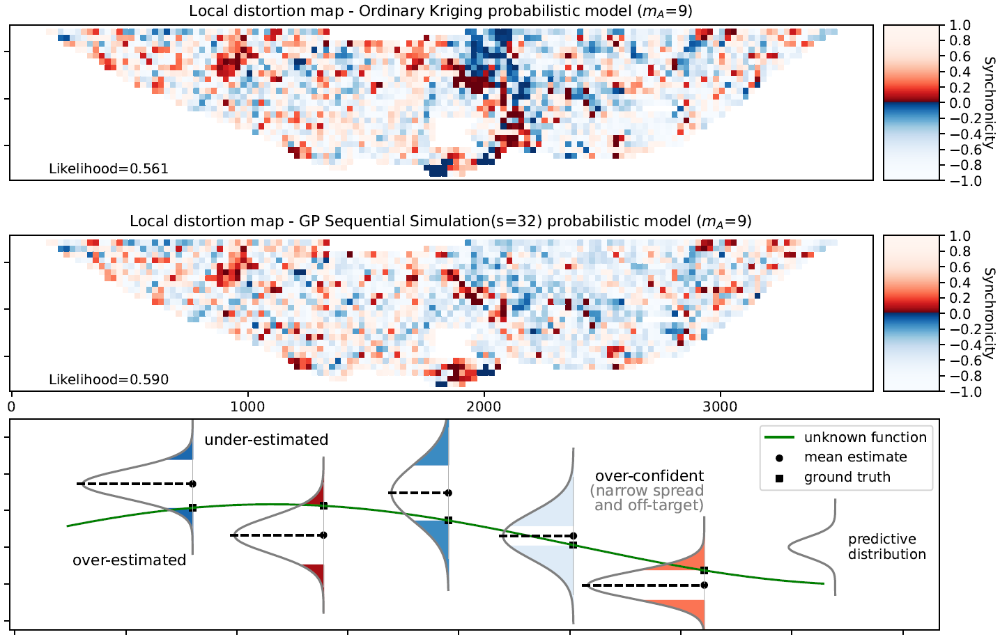

## EUP<sup>3</sup>M: Evaluating uncertainty and predictive performance of probabilistic models
## <font color="#cc0066">Open-Source Implementation</font>

Raymond Leung, Alexander Lowe<br>
Rio Tinto Centre, Faculty of Engineering<br>
The University of Sydney, NSW 2006 Australia<br>

## Themes
- Probabilistic models, uncertainty assessment, predictive performance, systematic evaluation
- Uncertainty-based measures, confidence interval, significance testing
- FLAGSHIP statistics: fidelity, local consensus, distribution accuracy, goodness, synchronicity, histogram distances, interval tightness, precision
- Kriging, Gaussian process, sequential Gaussian simulation (SGS), GP spatially correlated random field (CRF)
- Porphyry copper deposit, grade estimation, in-situ regression, future-bench prediction, 3D geological modelling.


## Audience
- Researchers and data scientists working in the geoscience modelling community who are interested in
  - Evaluating the performance of stochastic models, checking if the univariate
    probabilistic predictions are reasonable given validation measurements
  - Large-scale studies and simultaneous comparisons for multiple models
    across domains and inference periods (space and time)
  - Utilising variograms to objectively measure the spatial fidelity of models.
- Geologists and engineers working on orebody grade estimation in the mining industry who are interested in
  - Conveying uncertain predictions with a quantifiable degree of confidence
  - Methods for evaluating the strengths/weaknesses of competing models
  - Curious about the efficacy of future-bench predictions, with grade control or mine planning in mind.


## Overview
This repository provides an open-source implementation of the methods described in <a href="#cite:gmd">(Leung, Lowe and Melkumyan, 2024)</a>. The python code serves a dual purpose: it may be used to (a) build models and/or (b) evaluate model performance. As illustration, the picture below shows a comparison between two probabilistic models. One aspect it enables is the visualisation of the synchronicity measure (which indicates the consensus between the model prediction and groundtruth) as a local distortion map. The technical details are described in the referenced paper, however, it is worth emphasizing an essential feature that defines probabilistic models.

Probabilistic models view the modelled attribute (for example, the concentration of copper in a porphyry deposit) as a random process and uses a predictive distribution (e.g. providing the posterior mean and standard deviation as an estimate rather than a single value) to describe the attribute at an unobserved location. This viewpoint differs funadmentally from deterministic models and it is depicted at the bottom half of the image below.



### Probabilistic Models
The supported model construction methods include
- Simple and Ordinary Kriging, with and without Sequential Gaussian simulation
  - &rarr; SK, OK, SK-SGS, OK-SGS
- Gaussian Processes regression using local and global mean, optionally combined with sequential simulation and Cholesky Random Field, respectively
  - &rarr; GP(L), GP(G), GP-SGS, GP-CRF.

<a name="geostat-measures"></a>
### Geostatistical Measures
The implemented measures focus on 1) global accuracy, 2) local correlation and 3) uncertainty-based statistics
- Histogram / global accuracy measures (H) based on
  - Probabilistic symmetric Chi square distance
  - Jensen-Shannon divergence
  - Rudzica (Intersection-over-Union)
  - Wasserstein (Earth Moving) distance.
- Spatial correlation measures based on
  - Variogram ratios and
  - Spatial fidelity (F)
- Uncertainty statistics for the predictive distributions based on notion of 
  - Synchronicity (S) and local consensus (L) with respect to the groundtruth
  - Deutsch's accuracy (A), goodness (G), interval tightness (I) and precision (P) statistics.

Collectively, the recommended statistics (see <a href="#cite:gmd">paper</a> for discussion) are abbreviated as the FLAGSHIP statistics.

---

## Software Modules

The modelling algorithms are implemented in two modules:
- `code/gstatsim3d_gaussian_process.py` implements the GP(G), GP(L), GP-CRF and GP-SGS modelling approaches.
   It utilises the `scipy.linalg` and `scikit-learn` packages. The class method `GPManager.gaussian_process_simulations` is responsible for coordinating the learning and prediction
   activities. When sequential simulation is employed, it ensures the random paths are chosen for each
   run in a reproducible way using SHA256 hash.
- `code/gstatsim3d_kriging.py` implements the SK, OK, SK-SGS and OK-SGS modelling approaches.
   It utilises the `scikit-gstat` package and extends existing functionalities in `GStatSim`
   to support 3D data and an irregularly spaced inference grid. The class method
   `KrigingManager._kriging_common_workflow` is responsible for variogram fitting, inference
   and simulation activites. The APIs `kriging_regression` and `kriging_sequential_simulations`
   are used to compute SK/OK and SK-SGS/OK-SGS, respectively.

The <a href="#geostat-measures">geostatistical measures</a> are implemented in `code/rtc_evaluation_metrics.py`.

Graphical utility: `code/gstatsim3d_util.py` provides a method `make_scatter_2d` which was used to visualise synchronicity at estimated locations in the preamble. It essentially colours blocks based on a scalar attribute.


## Usage Example
The `code/run_experiments.py` script clarifies how the methods are used to build/evaluate models.
Critical to understanding the general setup are the notions of geological domain (gD) and inference
month (mA) which are used to partition the dataset into separate "regions" and "time periods".
The `run_experiments.py` script executes one experiment at a time, using standard configuration parameters specified in `rtcma_utils.py`. Importantly, the data exploited {(<b>x</b><sub>i</sub>,y<sub>i</sub>)}<sub>i=1:n</sub>,
where (<b>x</b><sub>i</sub>,y<sub>i</sub>) denotes the location and value of a known measurement, and locations
that require prediction {<b>x</b><sub>*,j</sub>}<sub>j=1:m</sub> are limited in scope by the input period and
domain identifier (mA, gD).

The standard syntax is
```
$python -m run_experiment ${inference_period_mA} ${geological_domain_gD} ${num_simulations}
```

For instance, the substitutions `inference_period_mA=4`, `geological_domain_gD=2310` and `num_simulations=16` should work. Refer to `data/domain_samples_summary.csv` for other valid values if the supplied data is used. The program supports two inference modes. By default, `future-bench-prediction` is assumed. This uses only data available prior to month `mA` to extrapolate into benches below or new territories adjacent to the current bench. To override this behaviour and perform interpolation instead, an optional argument `inference_type=in-situ-regression` may be appended to the above command. Refer to the <i>Data attributes and Experimental design</i> sections in the <a href="#cite:gmd">paper</a> for details.

## Jupyter Notebooks
For an interactive experience, users can run `notebook/run_experiments.ipynb` which provides basically the same functionality with the added bonus of visual feedback. This may be an instructive way to navigate through various concepts when one focuses solely on a single domain and inference period. A bash script `code/run_experiments.sh` was used by the authors to run a complete (and lengthy) set of experiments asynchronously on a machine with 30 CPUs, iterating over all domains (gD) and inference periods (mA).

For reference, `notebook/statistical_analysis.ipynb` shows how to compute confidence intervals and perform hypothesis testing using the FLAGSHIP statistics to establish if differences between models are statistically significant. As part of this analysis, the FLAGSHIP statistics are visualised as images to facilitate large-scale simultaneous comparisons as conditions (e.g. gD and mA) are varied. Synchronicity scores at inferenced points are displayed as a distortion map to reveal areas of under-estimation (or over-estimation) and contrast the performance of sequential simulation with the base models.

## Test Data
Each subdirectory `data/mA_mB_mC` provides the relevant data for inference period mA.
- `blastholes_tagged.csv` contains the relative coordinates (northing, easting, RL) of blastholes where assays were taken. The copper grade and relevant domain ID are reported in the `PL_CU` and `lookup_domain` columns.
- `blocks_to_estimate_tagged.csv` provides the inference locations where grade estimation is required via the `X`, `Y`, `Z` columns, the geologist assigned domains via the `domain` column, and validation measurements (groundtruth) via the `cu_bh_nn` column. This file is used only for future-bench prediction (grade extrapolation).
- `blocks_insitu_tagged.csv` is similar, except it is used only for in-situ regression (grade interpolation).


## Requirements
- Python version 3.8+. See required packages in [docker/requirements*.txt](docker/requirements-windows-python3.8.txt)


## Referenced Paper

- Raymond Leung, Alexander Lowe and Arman Melkumyan, <b>"Evaluating uncertainty and
  predictive performance of probabilistic models devised for grade estimation in a
  porphyry copper deposit,"</b> 2024. Preprint available in [/docs](https://github.com/raymondleung8/eup3m/blob/main/docs/background.pdf). 
  Code and data available at https://github.com/raymondleung8/eup3m under the BSD-3-Clause
  license.<a name="cite:gmd"></a>


## License

>📋  This project is licensed under the terms of the [BSD-3-Clause](LICENSE.md) license.

Further information about this program can be obtained from:

- Raymond Leung (raymond.leung@sydney.edu.au)
